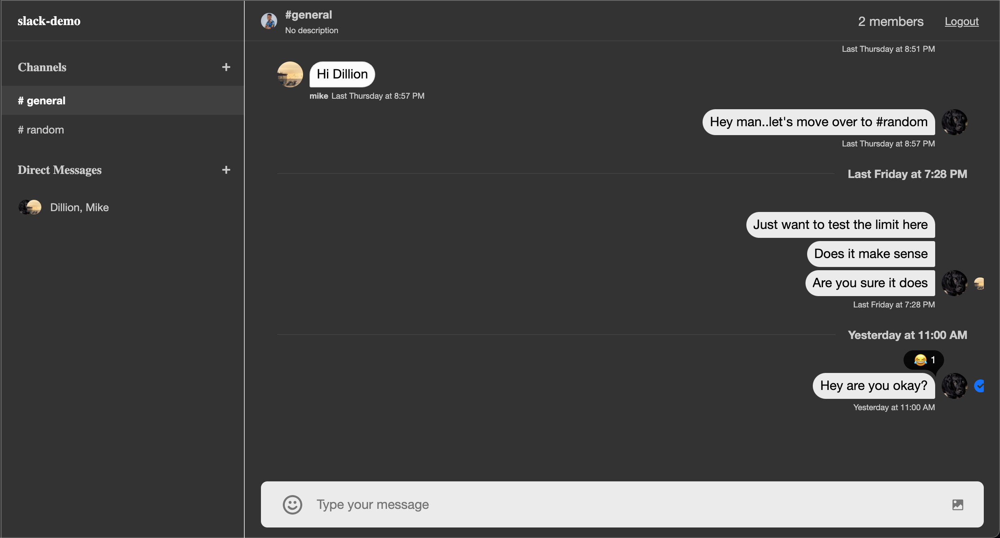
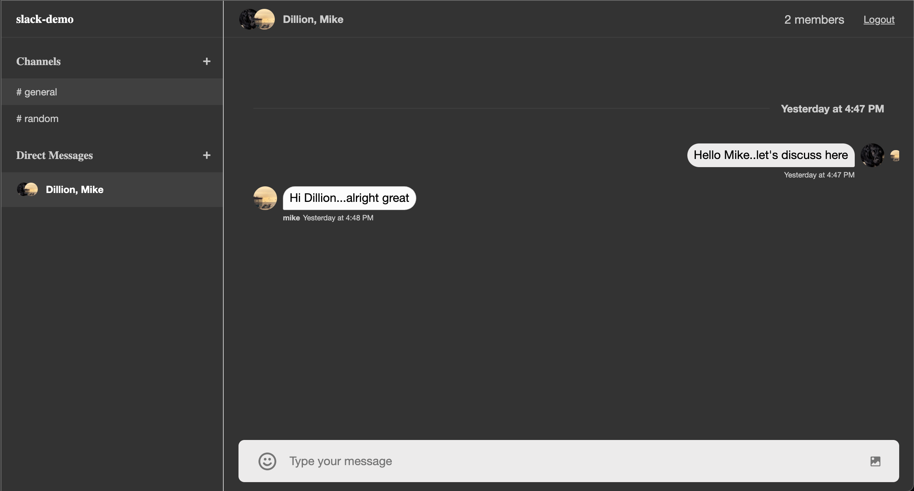
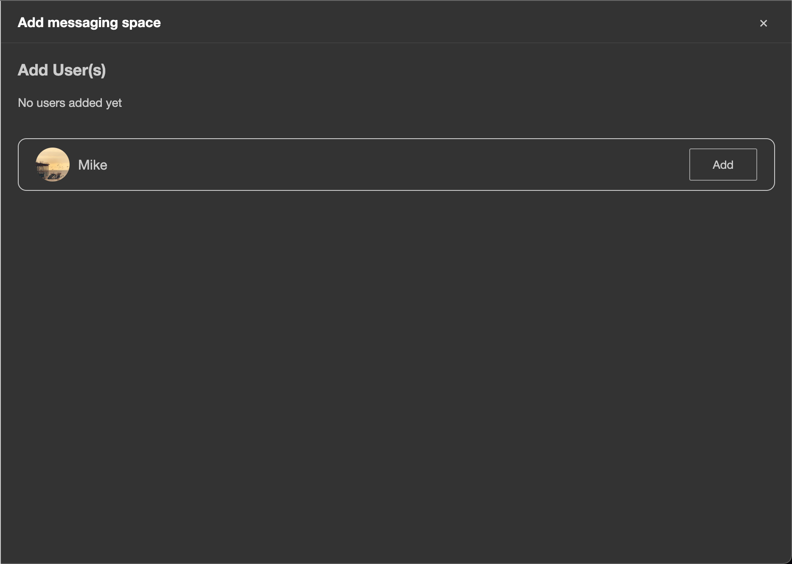
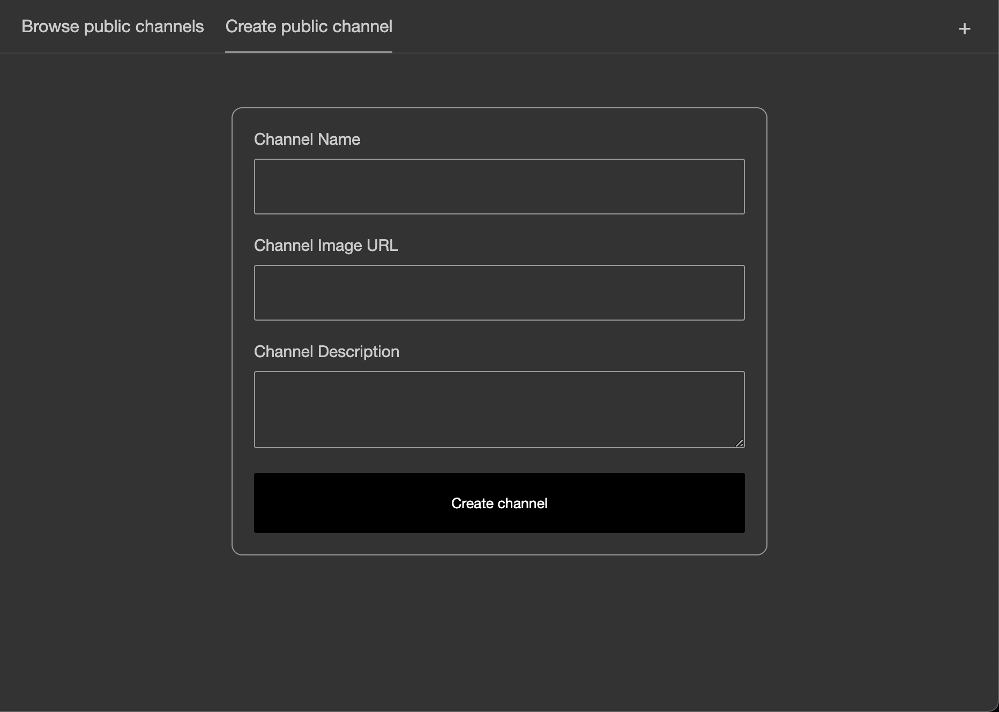
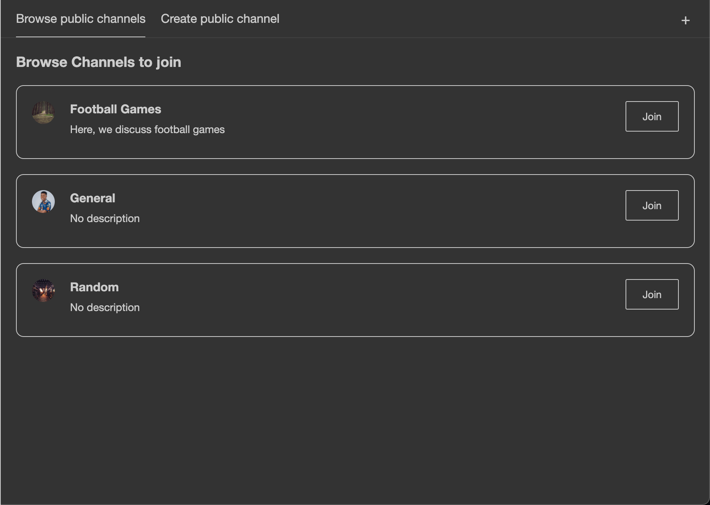
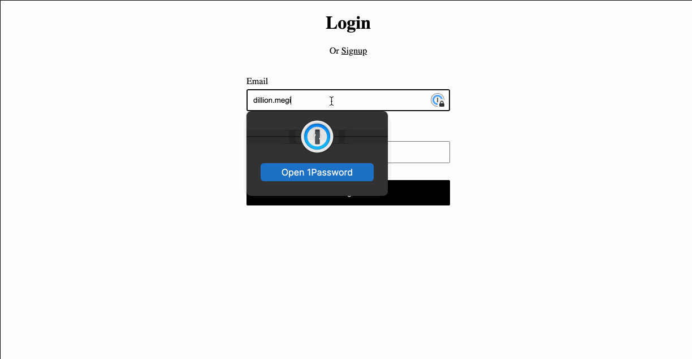

# Slack Demo

This is a sample project showing how to use [the Stream React SDK](https://getstream.io/chat/docs/sdk/react/) to build a team messaging application similar to slack. Here's the repo for the backend server: [slack-demo-server](https://github.com/dillionmegida/slack-demo-server).

## Table of Contents

- [Description](#description)
- [Gallery](#gallery)
  - [Video demo](#video-demo)
- [Setting up locally](#setting-up-locally)
  - [Requirements](#requirements)
  - [Clone the project](#clone-the-project)
  - [Install dependencies](#install-dependencies)
  - [Provide environment variables](#provide-environment-variables)
  - [Run the server](#run-the-server)
  - [TEsting the features](#testing-the-features)
- [Deployment](#deployment)
- [Author](#author)

## Description

Stream can be used in various ways, and this project shows how to build something similar to slack. The features for the app (currently) include:

- Custom UI components for SDK
- Authentication for users
- Creating public channels for all users
- Joining channels
- Creating channels for specific people

## Gallery







### Video demo

Here's the demo in play:



## Setting up locally

I couldn't deploy this project because of the database requirements (MongoDB), so here's how to set it up locally:

### Requirements

- [Node.js](https://nodejs.org/en/) installed on your machine.
- [MongoDB (Community Version)](https://docs.mongodb.com/manual/administration/install-community/) installed on your machine.
- [MongoDB Compass](https://www.mongodb.com/try/download/compass) installed on your machine. This provides a GUI for MongoDB.
- [Stream Account](https://getstream.io/try-for-free/)

### Clone the Project

The backend repo and the frontend repo work together. So be sure to check the [backend README.md file](https://github.com/dillionmegida/slack-demo-server), and follow the instructions there.

You would need to clone this repo and the backend repo as well.

```shell
git clone git@github.com:dillionmegida/slack-demo.git
```

### Install Dependencies

```shell
cd slack-demo
```

### Provide environment variables

As seen in the [.env.example file](./env.example), you need to provide the following environment variables in a `.env` file:

```shell
REACT_APP_STREAM_API_KEY = <your stream API key>
```

You would need to get your stream API key from your dashboard.

### Run the server

For the server to run correctly, you'd need the backend server to be running. Don't forget to follow the guide in the backend repo.

```bash
npm run start
```

With everything in place, when you go to `localhost:3000`, you'll see a login page. Since you do not have an account yet, you need to sign up on `localhost:3000/signup`.

And then you'll see the slack app, where you've been automatically added to the general and random channel.

As it is, you're the only user in the app. To add another user, open incognito mode and sign up as a different person.

### Testing the features

Now that you have the server running with two users, you can test the following that Stream allows us to do:

- create a public channel
- join a channel
- create a specific channel for you and the other user (still you 😅)

More features will be added as time goes (hopefully)

## Deployment

As long as the backend server is hosted correctly, and the APIs can be used, this frontend part can be hosted as easy as you would host any React app (on Netlify, Heroku, your other hosting providers).

## Author

[Dillion Megida](https://dillionmegida.com)
